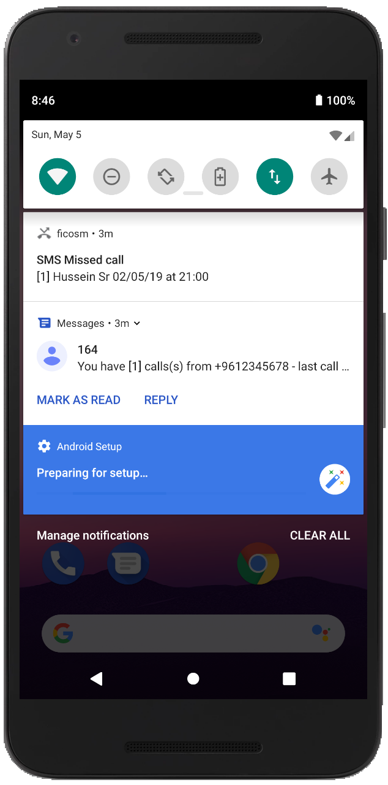

# ficosm
Parses Missed-Call SMS service notifications and retrieves contact name if found.

## To-do
* Store messages in a call history
* Choose between operators (currently works for Touch MC SMS service)
